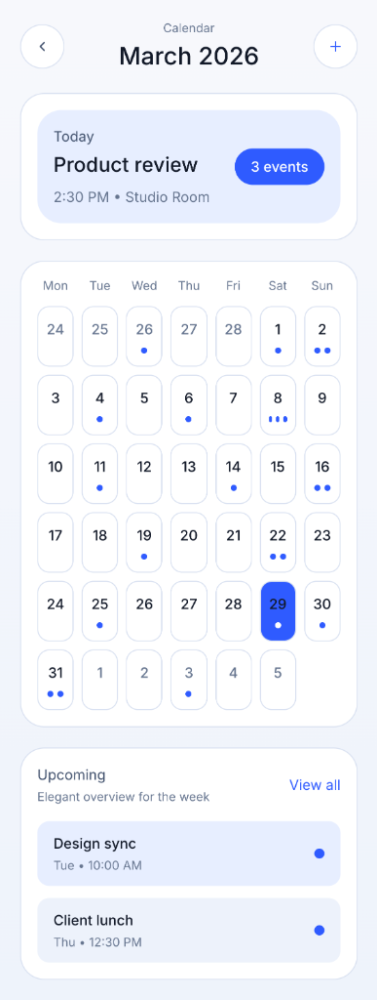
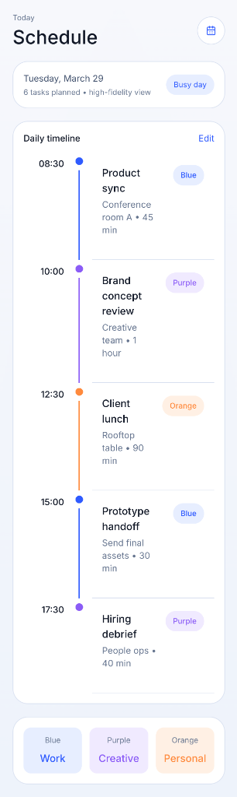
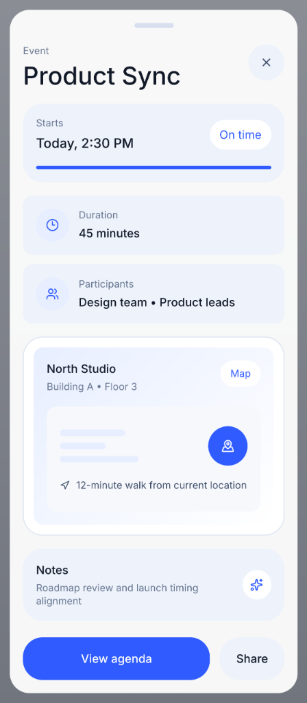

# 🗓️ Swift Calendar

**Minimalist. Elegant. Effortless Scheduling.**

Swift Calendar is a high-fidelity iOS-inspired calendar application built with Flutter. It combines the sleek aesthetic of the Apple ecosystem with the high performance of the Flutter engine, providing a premium scheduling experience.


## 📸 Screenshots

<p align="center">
  
  
  
</p>

## ✨ Features

- 📅 **Intuitive Month View** — A clean, grid-based month view with smooth transitions and day selection.
- 📋 **Daily Schedule Panel** — View your upcoming events in a beautifully organized list with color-coded categories.
- 🍏 **iOS Cupertino Design** — Native-look UI components including navigation bars, buttons, and typography.
- 🔔 **Event Alerts** — Integrated reminder system to ensure you never miss an important meeting.
- 🌓 **Adaptive Theme** — Supports system-wide light and dark modes with premium color palettes.
- ⚡ **High Performance** — Optimized rendering for 60fps scrolling and interactions.

## 🛠️ Tech Stack

- **Framework**: [Flutter](https://flutter.dev) (Cupertino Suite)
- **State Management**: [Riverpod](https://riverpod.dev)
- **UI/UX**: Apple Design Guidelines, [Table Calendar](https://pub.dev/packages/table_calendar)
- **Localization**: [Intl](https://pub.dev/packages/intl)
- **Architecture**: Clean Architecture

## 📁 Architecture Overview

```text
lib/
├── core/               # Shared constants and iOS styling
└── presentation/
    ├── pages/          # Cupertino screens
    └── widgets/        # Reusable iOS-style components
```

## 🚀 Getting Started

1. Clone the repository:
   ```bash
   git clone https://github.com/Adonias-hibeste/Swift-Calender-App-.git
   ```
2. Install dependencies:
   ```bash
   flutter pub get
   ```
3. Run the app:
   ```bash
   flutter run
   ```

## 👨‍💻 Developer

**Adonias Hibeste** — Lead Mobile Developer

---

*Note: This repository is a technical showcase of high-fidelity Cupertino UI and robust architecture implementation in Flutter.*
